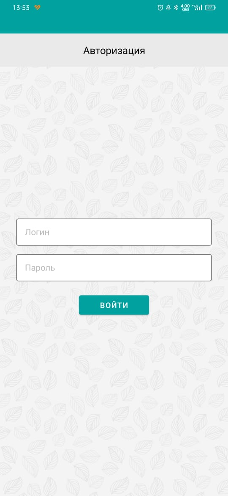
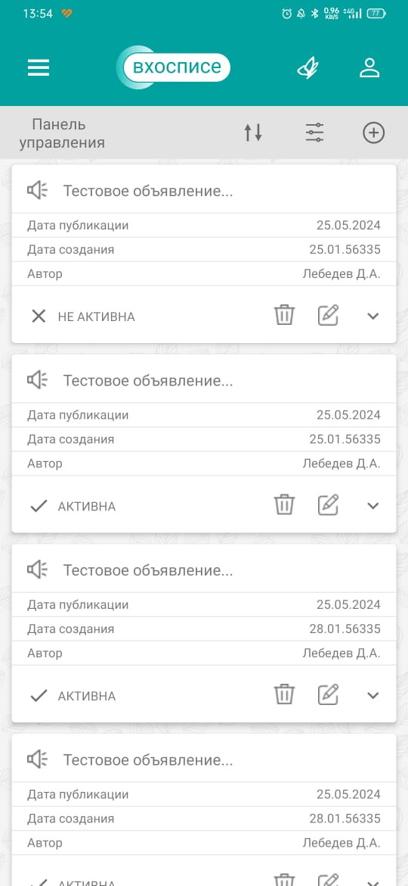
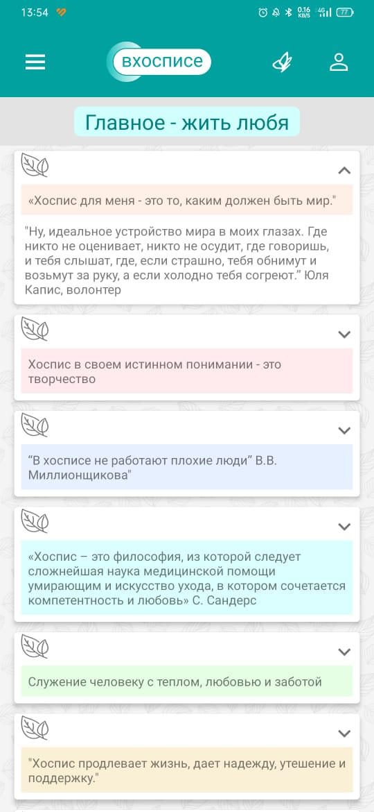

<head>
    <meta charset="utf-8">
                                                          
</head>

<h1>Дипломный проект QA engineer "Автоматизация тестирования мобильного приложения"</h1>

<h2>Решения</h2>

<h3>Проект <a href="https://github.com/Nephedov/Hospice_app_Testing">Hospice_app_Testing</a>.</h3>

<h4>Ручное тестирование</h4>

<ul>
    <li><a href="https://github.com/Nephedov/Hospice_app_Testing/blob/main/Plan.md">План тестирования</a>.</li>
    <li><a href="https://docs.google.com/spreadsheets/d/1ZpqrjkSXL7-bb3sfeUMSzOSLN_wH-k6e32FAxy3-efg/edit?usp=sharing">Чек-лист</a>.</li>
    <li><a href="https://docs.google.com/spreadsheets/d/1CbZAvNBLyisbj6GpB2eGxSrnAeyyoLprqT9UeDlj9Qc/edit?usp=sharing">Тест-кейсы</a>.</li>
    <li><a href="https://github.com/Nephedov/Hospice_app_Testing/blob/main/BugReports.md">Баг-репорты</a>.</li>
    <li><a href="https://github.com/Nephedov/Hospice_app_Testing/blob/main/ReportManual.md">Отчет</a>.</li>
</ul>

<h4>Автоматизированное тестирование</h4>

<ul>
    <li>Процедура запуска автотестов в <a href="https://github.com/Nephedov/Hospice_app_Testing/blob/main/README.md">README.md</a></li>
    <li>
        

Репозиторий <a href="https://github.com/Nephedov/Hospice_app_Testing/tree/main/fmh_android_15_03_24/app/src/androidTest/java/ru/iteco/fmhandroid/ui/tests">/tests</a> с автотестами.

            <ul>
                <li>
                    

UI автотесты

                        <ul>
                            <li>Класс <a href="https://github.com/Nephedov/Hospice_app_Testing/blob/main/fmh_android_15_03_24/app/src/androidTest/java/ru/iteco/fmhandroid/ui/tests/ui/SplashScreenTest.java">SplashScreenTest.java</a> с автотестами, проверяющими отображение элементов экрана загрузки.</li>
                            <li>Класс <a href="https://github.com/Nephedov/Hospice_app_Testing/blob/main/fmh_android_15_03_24/app/src/androidTest/java/ru/iteco/fmhandroid/ui/tests/ui/AuthorizationPageTest.java">AuthorizationPageTest.java</a> с автотестами, проверяющими отображение элементов страницы авторизации в приложении.</li>
                            <li>Класс <a href="https://github.com/Nephedov/Hospice_app_Testing/blob/main/fmh_android_15_03_24/app/src/androidTest/java/ru/iteco/fmhandroid/ui/tests/ui/MainPageTest.java">MainPageTest.java</a> с автотестами, проверяющими отображение элементов главного экрана приложения. Также отображение элементов AppBar панели на главной странице приложения.</li>
                            <li>Класс <a href="https://github.com/Nephedov/Hospice_app_Testing/blob/main/fmh_android_15_03_24/app/src/androidTest/java/ru/iteco/fmhandroid/ui/tests/ui/NewsPageTest.java">NewsPageTest.java</a> с автотестами, проверяющими отображение элементов страницы "Новости" приложения. Также отображение элементов AppBar панели на странице "Новости".</li>
                            <li>Класс <a href="https://github.com/Nephedov/Hospice_app_Testing/blob/main/fmh_android_15_03_24/app/src/androidTest/java/ru/iteco/fmhandroid/ui/tests/ui/NewsControlPanelPageTest.java">NewsControlPanelPageTest.java</a> с автотестами, проверяющими отображение элементов страницы "Панель управления" новостей. Также отображение элементов AppBar панели на странице "Панель управления".</li>
                            <li>Класс <a href="https://github.com/Nephedov/Hospice_app_Testing/blob/main/fmh_android_15_03_24/app/src/androidTest/java/ru/iteco/fmhandroid/ui/tests/ui/OurMissionPageTest.java">OurMissionPageTest.java</a> с автотестами, проверяющими отображение эелементов страницы тематических цитат. Таже отображение элементов AppBar панели страницы тематических циатат.</li>
                            <li>Класс <a href="https://github.com/Nephedov/Hospice_app_Testing/blob/main/fmh_android_15_03_24/app/src/androidTest/java/ru/iteco/fmhandroid/ui/tests/ui/AboutPageTest.java">AboutPageTest.java</a> с автотестами, проверяющими отображение элементов страницы "О приложении". Также отображение элементов AppBar панели страницы "О приложении".</li>
                        </ul>
                    

                </li>
                <li>
                    

Функциональные автотесты

                        <ul>
                            <li>Класс <a href="https://github.com/Nephedov/Hospice_app_Testing/blob/main/fmh_android_15_03_24/app/src/androidTest/java/ru/iteco/fmhandroid/ui/tests/functional/AuthorizationTest.java">AuthorizationTest.java</a> c автотестами авторизации в приложении, генерацию предупреждений при невалидной авторизации.</li>
                            <li>Класс <a href="https://github.com/Nephedov/Hospice_app_Testing/blob/main/fmh_android_15_03_24/app/src/androidTest/java/ru/iteco/fmhandroid/ui/tests/functional/ExternalLinksTest.java">ExternalLinksTest.java</a> c автотестами, проверяющими переход по ссылкам, со страницы технической информации приложения.</li>
                            <li>Класс <a href="https://github.com/Nephedov/Hospice_app_Testing/blob/main/fmh_android_15_03_24/app/src/androidTest/java/ru/iteco/fmhandroid/ui/tests/functional/NewsTest.java">NewsTest.java</a> с автотестами, проверяющими работу функционала новостей. Добавление, редактирование, удаление, поиск, фильтр.</li>
                        </ul>
                    

                </li>
            </ul>
        

    </li>
    <li><a href="https://github.com/Nephedov/Hospice_app_Testing/blob/main/allure-results.zip">Allure-отчеты</a> прогона автотестов.</li>
    <li><a href="https://github.com/Nephedov/Hospice_app_Testing/blob/main/ReportAuto.md">Отчет</a> по результатам проведения автоматизированного тестирования.</li>
</ul>

<h2>Объект тестирования</h2>
Android приложение <a href="https://github.com/Nephedov/Hospice_app_Testing/tree/main/fmh_android_15_03_24">"В Хосписе"</a>.

<h2>Что было сделано</h2>

<h4>Ручное тестирование</h4>

<ul>
    <li>
        

Реализован <a href="https://github.com/Nephedov/Hospice_app_Testing/blob/main/Plan.md">план тестирования</a>.

            <ul>
                <li>Определены <a href="https://github.com/Nephedov/Hospice_app_Testing/blob/main/Plan.md#%D0%B3%D1%80%D0%B0%D0%BD%D0%B8%D1%86%D1%8B-%D0%BF%D1%80%D0%B8%D0%BB%D0%BE%D0%B6%D0%B5%D0%BD%D0%B8%D1%8F">границы приложения</a>.</li>
                <li>Определен <a href="https://github.com/Nephedov/Hospice_app_Testing/blob/main/Plan.md#%D1%84%D1%83%D0%BD%D0%BA%D1%86%D0%B8%D0%BE%D0%BD%D0%B0%D0%BB-%D0%BF%D1%80%D0%B8%D0%BB%D0%BE%D0%B6%D0%B5%D0%BD%D0%B8%D1%8F">функционал приложения</a>.</li>
                <li>Определены необходимые <a href="https://github.com/Nephedov/Hospice_app_Testing/blob/main/Plan.md#%D1%82%D0%B5%D1%81%D1%82%D0%B8%D1%80%D0%BE%D0%B2%D0%B0%D0%BD%D0%B8%D0%B5">виды тестирования</a> приложения.</li>
                <li>Определены <a href="https://github.com/Nephedov/Hospice_app_Testing/blob/main/Plan.md#%D0%B8%D0%BD%D1%81%D1%82%D1%80%D1%83%D0%BC%D0%B5%D0%BD%D1%82%D1%8B-%D0%B8-%D1%83%D1%81%D1%82%D1%80%D0%BE%D0%B9%D1%81%D1%82%D0%B2%D0%B0">инструменты и устройства</a> необходимые для проведения тестирования.</li>
            </ul>
        

    </li>
    <li>Определены <a href="https://github.com/Nephedov/Hospice_app_Testing/blob/main/Plan.md#%D1%80%D1%83%D1%87%D0%BD%D0%BE%D0%B5-%D1%82%D0%B5%D1%81%D1%82%D0%B8%D1%80%D0%BE%D0%B2%D0%B0%D0%BD%D0%B8%D0%B5">временные рамки</a> необходимые для написания и реализации тестовых сценариев.</li>
    <li>Реализован <a href="https://docs.google.com/spreadsheets/d/1ZpqrjkSXL7-bb3sfeUMSzOSLN_wH-k6e32FAxy3-efg/edit?usp=sharing">чек-лист</a>, включающий 242 проверки, согласно опеределенным ранее <a href="https://github.com/Nephedov/Hospice_app_Testing/blob/main/Plan.md#%D1%82%D0%B5%D1%81%D1%82%D0%B8%D1%80%D0%BE%D0%B2%D0%B0%D0%BD%D0%B8%D0%B5">видам тестирования</a>. С отметками об успешности выполнения проверки.</li>
    <li>Реализован 281 <a href="https://docs.google.com/spreadsheets/d/1CbZAvNBLyisbj6GpB2eGxSrnAeyyoLprqT9UeDlj9Qc/edit?usp=sharing">тест-кейс</a>, согласно <a href="https://docs.google.com/spreadsheets/d/1ZpqrjkSXL7-bb3sfeUMSzOSLN_wH-k6e32FAxy3-efg/edit?usp=sharing">чек-листа</a>. С отметками об успешности выполнения тестовых сценариев и причинами.</li>
    <li>Заведены <a href="https://github.com/Nephedov/Hospice_app_Testing/blob/main/BugReports.md">баг-репорты</a> по результатам реализации тест-кейсов.</li>
    <li>Составлен <a href="https://github.com/Nephedov/Hospice_app_Testing/blob/main/ReportManual.md">отчет</a> по результатам реализации тест-кейсов.</li>
    <li>Составлен <a href="https://github.com/Nephedov/Hospice_app_Testing/blob/main/Plan.md#%D0%B0%D0%BD%D0%B0%D0%BB%D0%B8%D0%B7-%D1%80%D0%B5%D0%B7%D1%83%D0%BB%D1%8C%D1%82%D0%B0%D1%82%D0%BE%D0%B2-%D1%80%D1%83%D1%87%D0%BD%D0%BE%D0%B3%D0%BE-%D1%82%D0%B5%D1%81%D1%82%D0%B8%D1%80%D0%BE%D0%B2%D0%B0%D0%BD%D0%B8%D1%8F">список рекомендаций</a> по итогам проведения ручного тестирования. </li>
</ul>

<h4>Автоматизированное тестирование</h4>

<ul>
    <li>Описана процедура запуска автотестов в <a href="https://github.com/Nephedov/Hospice_app_Testing/blob/main/README.md">README.md</a>.</li>
    <li>
        

Настроено локальное тестовое окружение.

            <ul>
                <li>Установлена JDK 11.</li>
                <li>Определена переменная JAVA_HOME на JDK 11.</li>
                <li>Установлена Android Studio.</li>
                <li>Установлена последняя стабильная версия Android SDK.</li>
                <li>Установлен Allure.</li>
            </ul>
        

    </li>
    <li>
        

Настроен проект.

            <ul>
                <li>Указано использование JAVA_HOME для Gradle JDK проекта.</li>
                <li>
                    

Добавлены зависимости тестовых фрейморков, инструмента отчетности Allure, обработки времени и дат в <a href="https://github.com/Nephedov/Hospice_app_Testing/blob/main/fmh_android_15_03_24/app/build.gradle">build.gradle</a> приложения.

                        <ul>
                            <li>Зависимости <a href="https://github.com/Nephedov/Hospice_app_Testing/blob/eccbd22d799f3a79e7c027a636e51005b5dc83af/fmh_android_15_03_24/app/build.gradle#L55">Junit</a>.</li>
                            <li>Зависимости <a href="https://github.com/Nephedov/Hospice_app_Testing/blob/eccbd22d799f3a79e7c027a636e51005b5dc83af/fmh_android_15_03_24/app/build.gradle#L61">Espresso</a>.</li>
                            <li>
                                

Зависимости <a href="https://github.com/Nephedov/Hospice_app_Testing/blob/eccbd22d799f3a79e7c027a636e51005b5dc83af/fmh_android_15_03_24/app/build.gradle#L67">Allure</a>. Также:

                                    <ul>
                                        <li>Утилита <a href="https://github.com/Nephedov/Hospice_app_Testing/blob/eccbd22d799f3a79e7c027a636e51005b5dc83af/fmh_android_15_03_24/app/build.gradle#L71">Android Test Orchestrator</a> - для изменения стандартного расположения отчетов Allure.</li>
                                        <li>Файл с конфигурацией для Allure - <a href="https://github.com/Nephedov/Hospice_app_Testing/blob/eccbd22d799f3a79e7c027a636e51005b5dc83af/fmh_android_15_03_24/app/src/androidTest/resources/allure.properties">allure.properties</a>.</li>
                                        <li><a href="https://github.com/Nephedov/Hospice_app_Testing/blob/eccbd22d799f3a79e7c027a636e51005b5dc83af/fmh_android_15_03_24/app/build.gradle#L23">Allure-Junit раннер</a> для запуска тестов.</li>
                                        <li>Запуск тестовых классов реализован с AllureAndroidJUnit4.class.</li>
                                        <li>Добавлено заведение скриншотов, в случае падения тестового сценария.</li>
                                    </ul>
                                

                            </li>
                            <li>Зависимость библиотеки обработки времени и дат - <a href="https://github.com/Nephedov/Hospice_app_Testing/blob/eccbd22d799f3a79e7c027a636e51005b5dc83af/fmh_android_15_03_24/app/build.gradle#L52">Joda-Time</a>.</li>
                        </ul>
                    

                </li>
            </ul>
        

    </li>
    <li>Реализован Page Object подход к написанию автотестов:
        <ul>
            <li>
                

В репозитории <a href="https://github.com/Nephedov/Hospice_app_Testing/tree/main/fmh_android_15_03_24/app/src/androidTest/java/ru/iteco/fmhandroid/ui/data">/data</a> реализован служебный класс генерации тестовых данных - <a href="https://github.com/Nephedov/Hospice_app_Testing/blob/main/fmh_android_15_03_24/app/src/androidTest/java/ru/iteco/fmhandroid/ui/data/DataGenerator.java">DataGenerator.java</a>.

                    <ul>
                        <li>Данные авторизации <a href="https://github.com/Nephedov/Hospice_app_Testing/blob/eccbd22d799f3a79e7c027a636e51005b5dc83af/fmh_android_15_03_24/app/src/androidTest/java/ru/iteco/fmhandroid/ui/data/DataGenerator.java#L27">валидного пользователя</a>.</li>
                        <li>Данные авторизации <a href="https://github.com/Nephedov/Hospice_app_Testing/blob/eccbd22d799f3a79e7c027a636e51005b5dc83af/fmh_android_15_03_24/app/src/androidTest/java/ru/iteco/fmhandroid/ui/data/DataGenerator.java#L31">невалидного пользователя</a>.</li>
                        <li>Получение <a href="https://github.com/Nephedov/Hospice_app_Testing/blob/eccbd22d799f3a79e7c027a636e51005b5dc83af/fmh_android_15_03_24/app/src/androidTest/java/ru/iteco/fmhandroid/ui/data/DataGenerator.java#L53">текущей даты</a> в нужном формате.</li>
                        <li>Получение <a href="https://github.com/Nephedov/Hospice_app_Testing/blob/eccbd22d799f3a79e7c027a636e51005b5dc83af/fmh_android_15_03_24/app/src/androidTest/java/ru/iteco/fmhandroid/ui/data/DataGenerator.java#L57">текущего времени</a> в нужном формате.</li>
                        <li>Получение даты со сдвигом дней в <a href="https://github.com/Nephedov/Hospice_app_Testing/blob/eccbd22d799f3a79e7c027a636e51005b5dc83af/fmh_android_15_03_24/app/src/androidTest/java/ru/iteco/fmhandroid/ui/data/DataGenerator.java#L61">большую</a> и <a href="https://github.com/Nephedov/Hospice_app_Testing/blob/eccbd22d799f3a79e7c027a636e51005b5dc83af/fmh_android_15_03_24/app/src/androidTest/java/ru/iteco/fmhandroid/ui/data/DataGenerator.java#L65">меньшую</a> сторону от текущей.</li>
                        <li>Получение случайной <a href="https://github.com/Nephedov/Hospice_app_Testing/blob/eccbd22d799f3a79e7c027a636e51005b5dc83af/fmh_android_15_03_24/app/src/androidTest/java/ru/iteco/fmhandroid/ui/data/DataGenerator.java#L73">циферно-символьной строки</a>, кирилицей.</li>
                    </ul>
                

            </li>
            <li>
                

В репозитории <a href="https://github.com/Nephedov/Hospice_app_Testing/tree/main/fmh_android_15_03_24/app/src/androidTest/java/ru/iteco/fmhandroid/ui/matchers">/matchers</a> реализованы дополнительные классы для оптимизации проведения тестирования.

                    <ul>
                        <li>Класс <a href="https://github.com/Nephedov/Hospice_app_Testing/blob/main/fmh_android_15_03_24/app/src/androidTest/java/ru/iteco/fmhandroid/ui/matchers/TimeoutEspresso.java">TimeoutEspresso.java</a> - имеющий методы "оборачивающие" экземпляры Espresso: ViewAction, ViewAssertion, ViewInteraction и дополняемые тайм-аутами.</li>
                        <li>Класс <a href="https://github.com/Nephedov/Hospice_app_Testing/blob/main/fmh_android_15_03_24/app/src/androidTest/java/ru/iteco/fmhandroid/ui/matchers/ToastMatcher.java">ToastMatcher.java</a> - имеющий метод утверждения, что элемент является всплывающим (toast) и содержит определенную строку.</li>
                        <li>
                            

Класс <a href="https://github.com/Nephedov/Hospice_app_Testing/blob/main/fmh_android_15_03_24/app/src/androidTest/java/ru/iteco/fmhandroid/ui/matchers/CustomViewMatcher.java">CustomViewMatcher.java</a> - имеющий мэтчеры:

                                <ul>
                                    <li><a href="https://github.com/Nephedov/Hospice_app_Testing/blob/eccbd22d799f3a79e7c027a636e51005b5dc83af/fmh_android_15_03_24/app/src/androidTest/java/ru/iteco/fmhandroid/ui/matchers/CustomViewMatcher.java#L14">Позиции дочернего элемента</a> относительно родительского.</li>
                                    <li><a href="https://github.com/Nephedov/Hospice_app_Testing/blob/eccbd22d799f3a79e7c027a636e51005b5dc83af/fmh_android_15_03_24/app/src/androidTest/java/ru/iteco/fmhandroid/ui/matchers/CustomViewMatcher.java#L33">Количества элементов</a> компонента RecyclerView.</li>
                                </ul>
                            

                        </li>
                        <li>
                            

Класс <a href="https://github.com/Nephedov/Hospice_app_Testing/blob/main/fmh_android_15_03_24/app/src/androidTest/java/ru/iteco/fmhandroid/ui/matchers/CustomViewAction.java">CustomViewAction.java</a> - имеющий методы:

                                <ul>
                                    <li><a href="https://github.com/Nephedov/Hospice_app_Testing/blob/eccbd22d799f3a79e7c027a636e51005b5dc83af/fmh_android_15_03_24/app/src/androidTest/java/ru/iteco/fmhandroid/ui/matchers/CustomViewAction.java#L17">Клик по кнопке "Назад"</a> устройтва.</li>
                                    <li><a href="https://github.com/Nephedov/Hospice_app_Testing/blob/eccbd22d799f3a79e7c027a636e51005b5dc83af/fmh_android_15_03_24/app/src/androidTest/java/ru/iteco/fmhandroid/ui/matchers/CustomViewAction.java#L23">Клик по элементу</a> с определенным ID.</li>
                                    <li><a href="https://github.com/Nephedov/Hospice_app_Testing/blob/eccbd22d799f3a79e7c027a636e51005b5dc83af/fmh_android_15_03_24/app/src/androidTest/java/ru/iteco/fmhandroid/ui/matchers/CustomViewAction.java#L46">Остановка выполнения основного потока</a> на определенное количество секунд.</li>
                                </ul>
                            

                        </li>
                    </ul>
                

            </li>
            <li>
                

В репозитории <a href="https://github.com/Nephedov/Hospice_app_Testing/tree/main/fmh_android_15_03_24/app/src/androidTest/java/ru/iteco/fmhandroid/ui/pages">/pages</a> реализованы классы описывающие элементы страниц приложения и методы взаимодействия с ними.

                    <ul>
                        <li><a href="https://github.com/Nephedov/Hospice_app_Testing/blob/main/fmh_android_15_03_24/app/src/androidTest/java/ru/iteco/fmhandroid/ui/pages/SplashScreen.java">SplashScreen.java</a> - Класс описывающий элементы страницы загрузки экрана.</li>
                        <li><a href="https://github.com/Nephedov/Hospice_app_Testing/blob/main/fmh_android_15_03_24/app/src/androidTest/java/ru/iteco/fmhandroid/ui/pages/AuthorizationPage.java">AuthorizationPage.java</a> - Класс описывающий элементы и методы страницы авторизации приложения.</li>
                        <li><a href="https://github.com/Nephedov/Hospice_app_Testing/blob/main/fmh_android_15_03_24/app/src/androidTest/java/ru/iteco/fmhandroid/ui/pages/MainPage.java">MainPage.java</a> - Класс описывающий элементы и методы главной страницы приложения.</li>
                        <li><a href="https://github.com/Nephedov/Hospice_app_Testing/blob/main/fmh_android_15_03_24/app/src/androidTest/java/ru/iteco/fmhandroid/ui/pages/NewsPage.java">NewsPage.java</a> - Класс описывающий элементы и методы страницы новостей приложения.</li>
                        <li><a href="https://github.com/Nephedov/Hospice_app_Testing/blob/main/fmh_android_15_03_24/app/src/androidTest/java/ru/iteco/fmhandroid/ui/pages/ControlPanelPage.java">ControlPanelPage.java</a> - Класс описывающий элементы и методы страницы "Панель управления" новостей приложения.</li>
                        <li><a href="https://github.com/Nephedov/Hospice_app_Testing/blob/main/fmh_android_15_03_24/app/src/androidTest/java/ru/iteco/fmhandroid/ui/pages/OurMissionPage.java">OurMissionPage.java</a> - Класс описывающий элементы и методы страницы с тематическими цитатами приложения.</li>
                        <li><a href="https://github.com/Nephedov/Hospice_app_Testing/blob/main/fmh_android_15_03_24/app/src/androidTest/java/ru/iteco/fmhandroid/ui/pages/AboutPage.java">AboutPage.java</a> - Класс описывающий элементы и методы страницы приложения с технической информацией.</li>
                        <li><a href="https://github.com/Nephedov/Hospice_app_Testing/blob/main/fmh_android_15_03_24/app/src/androidTest/java/ru/iteco/fmhandroid/ui/pages/AppBarPanel.java">AppBarPanel.java</a> - Класс описывающий элементы и методы AppBar панелей на страницах приложения.</li>
                    </ul>
                

            </li>
            <li>
                

В репозитории <a href="https://github.com/Nephedov/Hospice_app_Testing/tree/main/fmh_android_15_03_24/app/src/androidTest/java/ru/iteco/fmhandroid/ui/steps">/steps</a> реализованы классы имеющие методы, описывающие операции, используемые в тестовых сценариях.

                    <ul>
                        <li>
                            

<a href="https://github.com/Nephedov/Hospice_app_Testing/blob/main/fmh_android_15_03_24/app/src/androidTest/java/ru/iteco/fmhandroid/ui/steps/Authorization.java">Authorization.java</a> - Класс описывающий процедуры:

                                <ul>
                                    <li><a href="https://github.com/Nephedov/Hospice_app_Testing/blob/eccbd22d799f3a79e7c027a636e51005b5dc83af/fmh_android_15_03_24/app/src/androidTest/java/ru/iteco/fmhandroid/ui/steps/Authorization.java#L16">Валидной</a>/<a href="https://github.com/Nephedov/Hospice_app_Testing/blob/eccbd22d799f3a79e7c027a636e51005b5dc83af/fmh_android_15_03_24/app/src/androidTest/java/ru/iteco/fmhandroid/ui/steps/Authorization.java#L22">невалидной</a> авторизации.</li>
                                    <li>Методы <a href="https://github.com/Nephedov/Hospice_app_Testing/blob/eccbd22d799f3a79e7c027a636e51005b5dc83af/fmh_android_15_03_24/app/src/androidTest/java/ru/iteco/fmhandroid/ui/steps/Authorization.java#L28">предварительной авторизации</a> перед каждым тестовым сценарием для @Before. И <a href="https://github.com/Nephedov/Hospice_app_Testing/blob/eccbd22d799f3a79e7c027a636e51005b5dc83af/fmh_android_15_03_24/app/src/androidTest/java/ru/iteco/fmhandroid/ui/steps/Authorization.java#L42">логаута</a> после выполнения тестового сценария для @After.</li>
                                </ul>
                            

                        </li>
                        <li><a href="https://github.com/Nephedov/Hospice_app_Testing/blob/main/fmh_android_15_03_24/app/src/androidTest/java/ru/iteco/fmhandroid/ui/steps/OpenPage.java">OpenPage.java</a> - Класс содержащий методы навигации по страницам приложения.</li>
                        <li>
                            

<a href="https://github.com/Nephedov/Hospice_app_Testing/blob/main/fmh_android_15_03_24/app/src/androidTest/java/ru/iteco/fmhandroid/ui/steps/NewsActions.java">NewsActions.java</a> - Класс описывающий операции:

                                <ul>
                                    <li><a href="https://github.com/Nephedov/Hospice_app_Testing/blob/eccbd22d799f3a79e7c027a636e51005b5dc83af/fmh_android_15_03_24/app/src/androidTest/java/ru/iteco/fmhandroid/ui/steps/NewsActions.java#L21">Добавления новости</a>.</li>
                                    <li><a href="https://github.com/Nephedov/Hospice_app_Testing/blob/eccbd22d799f3a79e7c027a636e51005b5dc83af/fmh_android_15_03_24/app/src/androidTest/java/ru/iteco/fmhandroid/ui/steps/NewsActions.java#L42">Изменение описания новости</a> c определенным названием.</li>
                                    <li><a href="https://github.com/Nephedov/Hospice_app_Testing/blob/eccbd22d799f3a79e7c027a636e51005b5dc83af/fmh_android_15_03_24/app/src/androidTest/java/ru/iteco/fmhandroid/ui/steps/NewsActions.java#L54">Изменение статуса новости</a> с определенным названием.</li>
                                    <li><a href="https://github.com/Nephedov/Hospice_app_Testing/blob/eccbd22d799f3a79e7c027a636e51005b5dc83af/fmh_android_15_03_24/app/src/androidTest/java/ru/iteco/fmhandroid/ui/steps/NewsActions.java#L66">Удаление новости</a> с определенным названием.</li>
                                </ul>
                            

                        </li>
                    </ul>
                

            </li>
            <li>
                

В репозитории <a href="https://github.com/Nephedov/Hospice_app_Testing/tree/main/fmh_android_15_03_24/app/src/androidTest/java/ru/iteco/fmhandroid/ui/tests">/tests</a> реализована автоматизация 13-ти <a href="https://github.com/Nephedov/Hospice_app_Testing/tree/main/fmh_android_15_03_24/app/src/androidTest/java/ru/iteco/fmhandroid/ui/tests/functional">функциональных</a> и 44-х <a href="https://github.com/Nephedov/Hospice_app_Testing/tree/main/fmh_android_15_03_24/app/src/androidTest/java/ru/iteco/fmhandroid/ui/tests/ui">ui</a> тестовых сценариев из <a href="https://docs.google.com/spreadsheets/d/1ZpqrjkSXL7-bb3sfeUMSzOSLN_wH-k6e32FAxy3-efg/edit?usp=sharing">чек-листа</a>.

                    <ul>
                        <li>
                            

UI автотесты

                                <ul>
                                    <li>Класс <a href="https://github.com/Nephedov/Hospice_app_Testing/blob/main/fmh_android_15_03_24/app/src/androidTest/java/ru/iteco/fmhandroid/ui/tests/ui/SplashScreenTest.java">SplashScreenTest.java</a> с автотестами, проверяющими отображение элементов экрана загрузки.</li>
                                    <li>Класс <a href="https://github.com/Nephedov/Hospice_app_Testing/blob/main/fmh_android_15_03_24/app/src/androidTest/java/ru/iteco/fmhandroid/ui/tests/ui/AuthorizationPageTest.java">AuthorizationPageTest.java</a> с автотестами, проверяющими отображение элементов страницы авторизации в приложении.</li>
                                    <li>Класс <a href="https://github.com/Nephedov/Hospice_app_Testing/blob/main/fmh_android_15_03_24/app/src/androidTest/java/ru/iteco/fmhandroid/ui/tests/ui/MainPageTest.java">MainPageTest.java</a> с автотестами, проверяющими отображение элементов главного экрана приложения. Также отображение элементов AppBar панели на главной странице приложения.</li>
                                    <li>Класс <a href="https://github.com/Nephedov/Hospice_app_Testing/blob/main/fmh_android_15_03_24/app/src/androidTest/java/ru/iteco/fmhandroid/ui/tests/ui/NewsPageTest.java">NewsPageTest.java</a> с автотестами, проверяющими отображение элементов страницы "Новости" приложения. Также отображение элементов AppBar панели на странице "Новости".</li>
                                    <li>Класс <a href="https://github.com/Nephedov/Hospice_app_Testing/blob/main/fmh_android_15_03_24/app/src/androidTest/java/ru/iteco/fmhandroid/ui/tests/ui/NewsControlPanelPageTest.java">NewsControlPanelPageTest.java</a> с автотестами, проверяющими отображение элементов страницы "Панель управления" новостей. Также отображение элементов AppBar панели на странице "Панель управления".</li>
                                    <li>Класс <a href="https://github.com/Nephedov/Hospice_app_Testing/blob/main/fmh_android_15_03_24/app/src/androidTest/java/ru/iteco/fmhandroid/ui/tests/ui/OurMissionPageTest.java">OurMissionPageTest.java</a> с автотестами, проверяющими отображение эелементов страницы тематических цитат. Таже отображение элементов AppBar панели страницы тематических циатат.</li>
                                    <li>Класс <a href="https://github.com/Nephedov/Hospice_app_Testing/blob/main/fmh_android_15_03_24/app/src/androidTest/java/ru/iteco/fmhandroid/ui/tests/ui/AboutPageTest.java">AboutPageTest.java</a> с автотестами, проверяющими отображение элементов страницы "О приложении". Также отображение элементов AppBar панели страницы "О приложении".</li>
                                </ul>
                            

                        </li>
                        <li>
                            

Функциональные автотесты

                                <ul>
                                    <li>Класс <a href="https://github.com/Nephedov/Hospice_app_Testing/blob/main/fmh_android_15_03_24/app/src/androidTest/java/ru/iteco/fmhandroid/ui/tests/functional/AuthorizationTest.java">AuthorizationTest.java</a> c автотестами авторизации в приложении, генерацию предупреждений при невалидной авторизации.</li>
                                    <li>Класс <a href="https://github.com/Nephedov/Hospice_app_Testing/blob/main/fmh_android_15_03_24/app/src/androidTest/java/ru/iteco/fmhandroid/ui/tests/functional/ExternalLinksTest.java">ExternalLinksTest.java</a> c автотестами, проверяющими переход по ссылкам, со страницы технической информации приложения.</li>
                                    <li>Класс <a href="https://github.com/Nephedov/Hospice_app_Testing/blob/main/fmh_android_15_03_24/app/src/androidTest/java/ru/iteco/fmhandroid/ui/tests/functional/NewsTest.java">NewsTest.java</a> с автотестами, проверяющими работу функционала новостей. Добавление, редактирование, удаление, поиск, фильтр.</li>
                                </ul>
                            

                        </li>
                    </ul>
                

            </li>
        </ul>
    </li>
    <li>Собраны <a href="https://github.com/Nephedov/Hospice_app_Testing/blob/main/allure-results.zip">Allure-отчеты</a> по результатм прогона автотестов.</li>
    <li>Составлен <a href="https://github.com/Nephedov/Hospice_app_Testing/blob/main/ReportAuto.md">отчет</a> по результатам проведения автоматизированного тестирования.</li>
    <li>Сделан <a href="https://github.com/Nephedov/Hospice_app_Testing/blob/main/Plan.md#%D0%B0%D0%BD%D0%B0%D0%BB%D0%B8%D0%B7-%D1%80%D0%B5%D0%B7%D1%83%D0%BB%D1%8C%D1%82%D0%B0%D1%82%D0%BE%D0%B2-%D0%B0%D0%B2%D1%82%D0%BE%D0%BC%D0%B0%D1%82%D0%B8%D0%B7%D0%B8%D1%80%D0%BE%D0%B2%D0%B0%D0%BD%D0%BD%D0%BE%D0%B3%D0%BE-%D1%82%D0%B5%D1%81%D1%82%D0%B8%D1%80%D0%BE%D0%B2%D0%B0%D0%BD%D0%B8%D1%8F">вывод</a> по результатам автоматизации тестовых сценариев.</li>
</ul>

<h2>Описание приложения</h2>

Приложение даёт функционал по работе с новостями хосписа и включает в себя:
    <ul>
        <li>Информацию о новостях и функционал для работы с ними.</li>
        <li>Тематические цитаты.</li>
        <li>Информацию о приложении.</li>
        <li>
            

Страницы приложения.

                

                            

                                <figure class="app-image">
                                    
                                    <figcaption>Экран загрузки</figcaption>
                                </figure>
                            

                            

                                <figure class="app-image">
                                    
                                    <figcaption>Авторизация</figcaption>
                                </figure>
                            

                            

                                <figure class="app-image">
                                    
                                    <figcaption>"Панель управления"</figcaption>
                                </figure>
                            

                            

                                <figure class="app-image">
                                    
                                    <figcaption>Экран загрузки</figcaption>
                                </figure>
                            

                            

                                <figure class="app-image">
                                    
                                    <figcaption>"Панель управления"</figcaption>
                                </figure>
                            

                            

                                <figure class="app-image">
                                    
                                    <figcaption>Тематические цитаты</figcaption>
                                </figure>
                            

                            

                                <figure class="app-image">
                                    
                                    <figcaption>"О приложении"</figcaption>
                                </figure>
                            

                

            

        </li>
    </ul>

Этапы выполнения
    <ol>
        <li>Проверка приложения.</li>
        <li>Автоматизация проверки приложения.</li>
        <li>Составление отчёта.</li>
    </ol>

